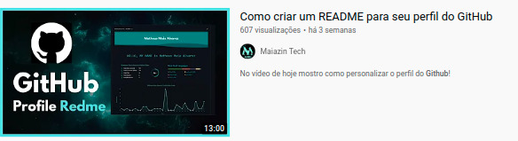

# Components

# Markdown

Markdown é uma sintaxe de leitura e gravação fáceis para formatação de texto sem formatação.

Adicionamos algumas funcionalidades personalizadas para criar o markdown em estilo GitHub, usadas para formatar prosa e código em nosso site.

Você também pode interagir com outros usuários em pull requests e problemas usando recursos como @menções, referências a problemas e pull request e emoji.

## Mencionar pessoas e equipes

* @github/suporte O que você acha dessas atualizações?

## Fazer referências a problemas e pull requests

#218 - Card

#3 - issues

## Code Blocks

### Python
```py
    print('Code py');
```

### Readme
```readme
    
# Title 1

## Sub title 1

```

### CMD
```shell
orfeo show #218
```

## Tasks

- [x] #739
- [ ] https://github.com/octo-org/octo-repo/issues/740
- [ ] Add delight to the experience when all tasks are complete :tada:

# Table

| Primeiro cabeçalho  |  Segundo cabeçalho  |
| ------------------- | ------------------- |
|  Célula de conteúdo |  Célula de conteúdo |
|  Célula de conteúdo |  Célula de conteúdo |

# Baseboard

Teste 123[^1]

* Teste 123[^2]
    * Teste 123[^3]


# Image

* 

# Video

[](https://www.youtube.com/watch?v=VEVJQipsA7M)

# Video Reference

## Video Reference Summarized

> 
### https://www.youtube.com/watch?v=UVtgFN3K6kE

## Video Reference Complete

> # CI/CD Git Hub 
### https://youtu.be/R8_veQiYBjI


## Video Reference Complete with more elements

> # CI/CD Git Hub 
### https://youtu.be/R8_veQiYBjI

* 

* 

```python

tkinter.messagebox.askyes(title="[title]", message="""
# [message exemplo componente]
"""
, **options)

```
* 

```python

tkinter.messagebox.askyesnocancel(title="[title]", message="""
# [message exemplo componente yes-no-cancel]
"""
, **options)

```

## Diagrams

Here is a simple flow chart:


## Subscribe Button


## My Profile Resume

| [<br><sub>Luã Govinda</sub>](https://github.com/govinda777) |
| :---: |

[<br><sub>Luã Govinda</sub>](https://github.com/govinda777)
https://www.linkedin.com/in/govinda777/recent-activity/

## My Profile

| [<br><sub>Luã Govinda</sub>](https://github.com/govinda777) |
| :---: |

* [linkedin] profile: https://www.linkedin.com/in/govinda777/
* [linkedin] recent activity : https://www.linkedin.com/in/govinda777/recent-activity/
* [govindas-tech-talk] recommended courses: 

[<br><sub>Luã Govinda</sub>](https://github.com/govinda777)
https://www.linkedin.com/in/govinda777/recent-activity/

## Profile Experience List

<p align="left">

<a href="https://www.cea.com.br/">

</a>

</p>

<p>C&A Modas S.A</p>

<p>
<ul>
<li>
<h1>Release Train Engineer</h1>    
<p>nov de 2021 - o momento · 6 meses</p>
<p>São Paulo, Brasil</p>


<p>
Desenvolvimento de processos de Software Release. 
Treinamento de equipes, Agile Masters, Tech Leads nos processos de Software Release. 
Comunicar e escalar de forma transparente impedimentos. 
Analisar o fluxo de entrega para mapear gargalos e implementar melhorias no processo. 
Incentivar a colaboração entre equipes. 
Alinhar com POs, PMs e outros colaboradores a fim de ajudar a garantir o alinhamento da estratégia e da execução. 
Facilitar reuniões correspondente ao processo de entrega. 
Criar de relatórios automatizados a fim de refletir a atual situação do release.Desenvolvimento de processos de Software Release. 
Treinar de equipes, Agile Masters, Tech Leads nos processos de Software Release. 
Comunicar e escalar de forma transparente impedimentos. 
Analisar o fluxo de entrega para mapear gargalos e implementar melhorias no processo. 
Incentivar a colaboração entre equipes. 
Alinhar com POs, PMs e outros colaboradores a fim de ajudar a garantir o alinhamento da estratégia e da execução. 
Facilitar reuniões correspondente ao processo de entrega. 
Criar de relatórios automatizados a fim de refletir a atual situação do release.
</p>
</li>
</ul>
</p>

## See My Full Profile

https://github.com/govinda777/profile

## Next steps

Criar uma automação para os compoenentes usando o gulpfile

## Links

* [link_para_vc_me_ensinar](https://github.com/govinda777/orfeo/blob/main/README-Como_me_ensinar.md)
* [Link_do_seu_repositorio](https://github.com/pedrokioshi)
* [GitHub Flavored Markdown Spec](https://github.github.com/gfm/)
* [readme.io](https://rdmd.readme.io/docs)

## Footer

* [^1]: Referencia 1.
* [^2]: Referencia 2.
* [^3]: Referencia 3.
