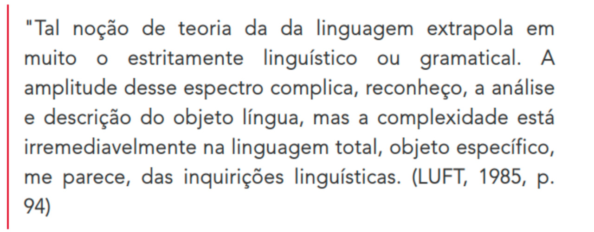
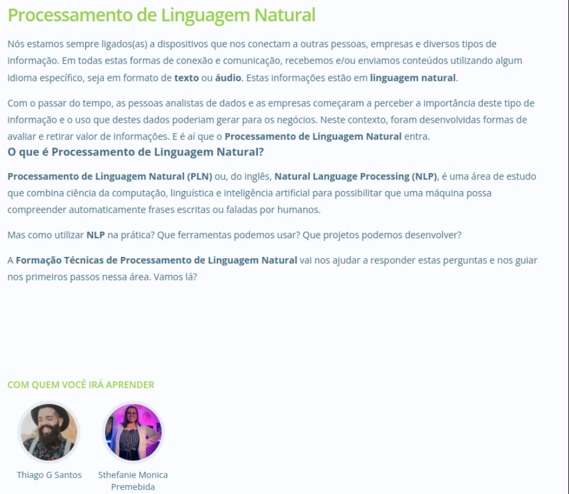
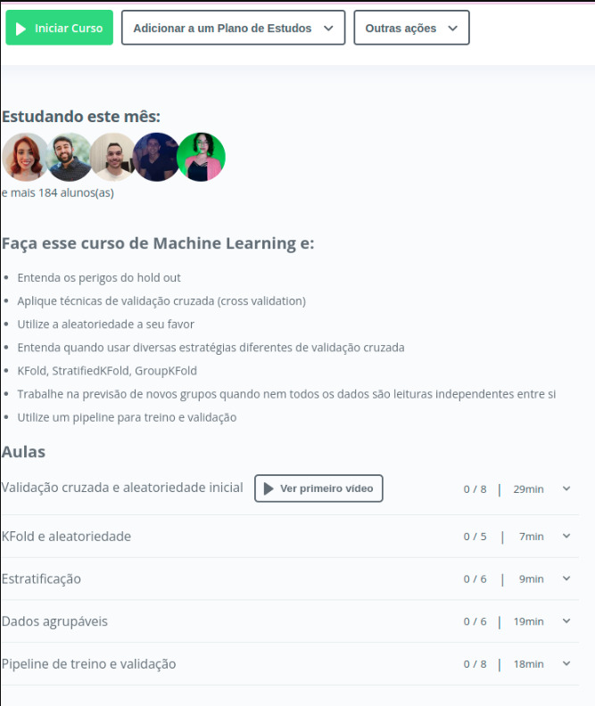

# Orfeo


## Explicando o Orfeo.

Orfeu é uma inteligencia artificial, onde receberá dados da Comunidade onde ele se encontra e executará tarefas pré programadas.

(
* Veja que é a comunidade que passa as informações para ele.

```cmd
    <Integrantes da comunidade> | <Irmãos> , por favor, não me ensinem coisas erradas para mim, tenho apenas 2 anos de vida.
```
)

- Chatterbot como canal de comunicação.
- Robo amigo da comunidade, afim de apoiar os novos e atuais integrantes com suas tarefas.
- Robo que ajudará nas relações inter pessoais das pessoas na comunidade.

## Objetivo

O grande objetivo do Orfeo é ser uma consciencia artificial estendida da comunidade.

Tem como méta :

- [_] Apoiar na integração dos novos individuos da comunidade.
- [_] Ser um canal de comunicação com os integrantes.
- [_] Executar tarefas previamente programadas (a comunidade poderá ensinar o Orfeo)
- [_] 

## Personalidade

- Senso de humor
- Objetividade (afinal é um robo)

## Regras gramaticais

<Ativo> = Ativo | Asset | Tudo que tem valor

$- 99 -$  = Valor monetário a receber.
$- -99 -$ = Valor monetário a pagar.

## Compilador

Verificação de regras e lógicas gramaticais

## Utilizo Python pra que?  (https://www.python.org/)

Executar tarefas automatizadas.

## Utilizo README pra que?  

Marcdown corresponde a parte da forma de se escreber código no Orfeo

(https://docs.github.com/pt/get-started/writing-on-github/getting-started-with-writing-and-formatting-on-github/basic-writing-and-formatting-syntax)

## Utilizo Nodejs e Gulp pra que?

Ferramenta para compilação e compactação do código.

## Como que eu faço para responder um pergunta?

Inicialmente as perguntas são repassadas para a comunidade e o Orfeo ajudará na integração do participante a comunidade.

# Linguistica




https://www.alexandrefelix.com.br/post/resenha-l%C3%ADngua-liberdade-apontamentos-lingu%C3%ADsticos-estampados-no-jornal


## Como cadastrar uma piada

```py

orfeo.joke.append"Piada") orfeo.joke.append("http://piada.link"

```

## Antes de me fazer uma pergunta, vê primeiro se o Google não sabe. 

```py 

print("Sempre é bom consultar os mais velhos") 

```

## Execução de tarefas repetitivas

```py 

print("Eu posso te ajudar a escrever e compartilhar seu Artigo.

```

## Eu posso te ajudar a compartilhar e catalogar informações. (com isso eu tambem fico mais esperto, porem vc terá que falar a minha lingua)

...............

## Como ensinar o Orfeo a fazer uma tarefa pra você ?

["L'Orfeo tutorial-1"](./README.LOrfeo_Lang.md)

## Como pedir ajuda ao Orfeo ?

["L'Orfeo tutorial-2"](./README.LOrfeo_Lang.md)

> Obs: O orfeo sempre irá perguntar para a comunidade primeiro e irá registrar a resposta na Wiki da empresa.

## Como cadastrar itens no dicionário

...........

## Tarefas

#### [_] - $- 03 -$ - Escolha seu Avatar favorito - $- <Oculos_Para_OrfeO> -$

## Orfeo faces


## Integração com platadorma Kanban (kanbantool)

O Orfeo te ajuda a gerenciar as atividades da sua empresa, cadastrando suas tarefas em um kanban e te apoiando com a gestão visual das atividades.


## Avaliações


```cmd

*
*
*___
*
* [**__Avaliações__**].[**__1__**]
*___
*

:tongue:
:eyes:
:joy:

```


__Estão_A_qui_a_lista_de_Linguas_ID251_data_29_6_22_Dia_da_Entrega_da_caixinha_da_Mit_Fofuras__

Abreviação de Localização
Abreviação	Idioma
de	Alemão
ar	Árabe
bn-BD	Bengali-Bangladesh
bn-IN	Bengali-Índia
zh-CN	Chinês (Simplificado)
zh-TW	Chinês (Tradicional)
ko	Coreano
da	Dinamarquês
sk	Eslovaco
sl	Esloveno
es	Espanhol
fi	Finlandês
fr	Francês
el	Grego
nl	Holandês
hu	Húngaro
hi-IN	Indiano
id	Indonésio
en-US	Inglês
it	Italiano
ja	Japonês
no	Norueguês
pl	Polonês
pt-BR	Português (Brasileiro)
pt-PT	Português (Europeu)
ro	Romeno
ru	Russo
sr-Cyrl	Sérvio - cirílico
sv	Sueco
th	Tailandês
cs	Tcheco
tr	Turco

## Meta liguagem

* $- < English _ Pratic > -$
* $- < English _ Pratic > -$
* $- <English_Pratic> -$

["L'Orfeo"](./README.LOrfeo_Lang.md)


# Orfeo tutorial

## Como baixar | Primeiro Commit :robot:

```python

cd projetos
git clone https://github.com/govinda777/orfeo.git
git add --all
git commit -m 'print("Olá <GIT> eu sou o <Orfeo> \n um [Chatterbot]. Sou **representante** de Inteligencias Coletivas.")'


```

## Como criar um bug

* -------------

## Cursos



https://cursos.alura.com.br/formacao-tecnicas-processamento-linguagem-natural?$cupom$


https://cursos.alura.com.br/formacao-tecnicas-processamento-linguagem-natural?$cupom$


https://cursos.alura.com.br/formacao-machine-learning-negocios-digitais?$cupom$


https://cursos.alura.com.br/course/machine-learning-introducao-a-classificacao-com-sklearn?$cupom$



https://cursos.alura.com.br/course/machine-learning-validando-modelos?$cupom$

## Free courses

https://www.youtube.com/watch?v=eNpkQOMnF8g

https://www.youtube.com/watch?v=FoQ8lQHPwgo

https://www.youtube.com/watch?v=t9p4pJxZ1A0

<p style="magin-top:100px" align="left">

<a href="https://github.com/govinda777/buy-me-a-coffe">


<$- Buy-me-a-coffe -$>

</a>

</p>

https://github.com/sponsors/govinda777

